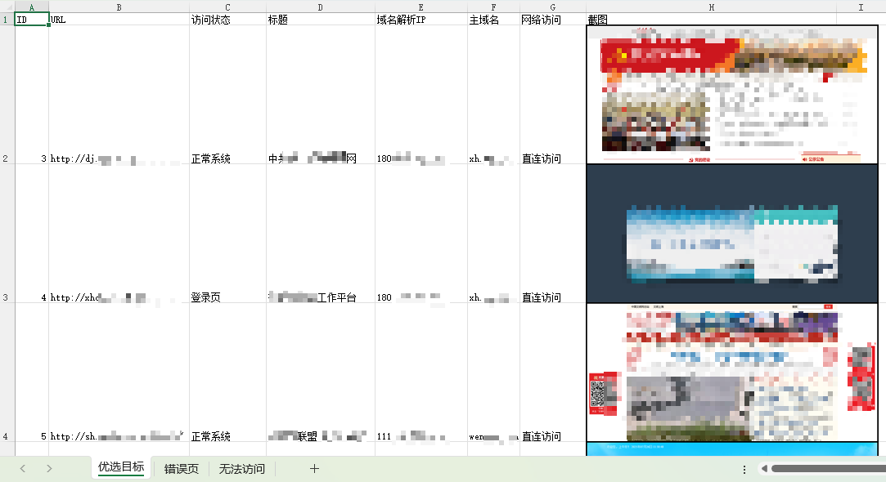

# 背景
快速筛选有效资产，批量测试目标资产的访问状态。

# 使用
#### 下载webdriver
https://github.com/mozilla/geckodriver/releases

```bash
#配置环境变量
setx geckodriver_exe /path/to/geckodriver.exe
#创建虚拟环境
python -m venv venv
#激活虚拟环境
venv\Scripts\activate.bat 
#安装依赖
pip install -r requirements.txt
#启动程序
python batchURL.py -h
```
默认windows系统，其他操作系统自行适配
#### 辅助脚本
以每行`ip:port`形式保存在`ip_port.txt`文件中，运行脚本，自动创建`url-prod.txt`作为扫描目标清单
```bash
python webTargetFilter.py
```
# 使用效果



# TODO

- [ ] 简单的信息收集工作(访问资产-》对IP/域名执行正反查询；扫描静态文件，发现潜在的信息泄露)
- [ ] 简单的漏洞扫描(访问资产-》指纹匹配-》调用对应的poc完成扫描)